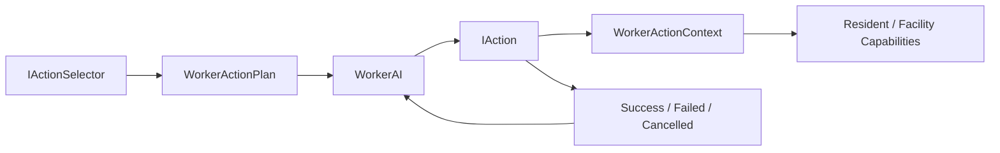

# ARCHITECTURE

> 문서 상태: 초안 0.1  
> 작성 기준: 2026-06-22  
> 요구사항 기준: `PublicMD/SPEC.md` 초안 0.2  
> 구조 기준: `PublicMD/ProjectStructure.md`, `PublicMD/CodeConvention.md`  
> 엔진: Unity 6000.3.9f1, URP 2D  
> 현재 실행 씬: `Assets/Scenes/SampleScene.unity`

## 1. Overview

이 문서는 AI 주민이 자율적으로 생활·생산·성장하고, 정착지가 모집·경제·방어·치료를 순환하는 게임을 현재 Worker 행동 프로토타입 위에 점진적으로 구축하기 위한 아키텍처를 정의한다.

핵심 목표는 다음과 같다.

- 기존 `WorkerAI → IActionSelector → WorkerActionPlan → IAction → WorkerActionContext` 실행 구조를 유지한다.
- 행동 선택, 행동 실행, 상태 소유, 데이터 설정과 화면 표시의 책임을 분리한다.
- 재고·골드·직업 경험치·전투 상태를 주민 행동 코드에 숨겨 소유하지 않는다.
- 모든 런타임 의존성을 씬 구성 또는 명시적 초기화로 연결하고 전역 singleton 조회를 사용하지 않는다.
- 조정 수치는 ScriptableObject 중심으로 관리하며 동일 난수 시드에서 결과를 재현할 수 있게 한다.
- 첫 생산 수직 슬라이스부터 검증 가능한 상태로 확장하고, 전체 프레임워크를 먼저 재작성하지 않는다.

### Architectural Constraints

- `WorkerAI`는 active plan 생명주기와 action tick만 소유한다.
- selector는 의도를 결정하고 plan을 구성하지만 직접 이동·상태 변경·애니메이션·UI 갱신을 하지 않는다.
- `IAction`은 실행 흐름, 성공·실패·취소 규칙을 소유한다.
- `WorkerActionContext`는 필요한 capability를 노출하지만 새로운 시스템의 범용 서비스 로케이터가 되어서는 안 된다.
- 시설 GameObject는 위치, 재고, 체력, 치료 슬롯 등의 독립 component를 조합할 수 있지만 한 component가 모든 시설 기능을 소유하지 않는다.
- 현재 범위에는 저장/불러오기, 멀티플레이, Addressables 기반 콘텐츠 배포가 포함되지 않는다.
- 성능 목표와 대상 플랫폼은 아직 `TBD`이므로 ECS/Jobs 또는 대규모 pooling을 선제 도입하지 않는다.

## 2. Requirement Drivers

| Driver | Architectural Consequence | Related Requirements |
|---|---|---|
| 주민 자율 행동 | selector와 action plan을 결정·실행 경계로 유지한다. | REQ-F-001, REQ-F-002 |
| 주민별 독립 상태 | 욕구, 스탯, 직업 진행도, 전투 상태와 운반 상태를 주민별 runtime object로 소유한다. | REQ-F-004~019, REQ-NF-005 |
| 물리적 생산·운반·보관 | 주민 운반 저장소와 시설 재고 사이의 명시적 transfer 계약이 필요하다. | REQ-F-020~025 |
| 성장과 전직 | 직업 정의 데이터와 주민별 직업 진행 상태를 분리한다. | REQ-F-004~012, REQ-F-026 |
| 침공과 패배 | wave lifecycle, 표적 정책, 독립 health, 게임 흐름 상태를 분리한다. | REQ-F-003, REQ-F-027~033 |
| 교역과 모집 | 재고와 골드를 하나의 transaction에서 검증·변경해야 한다. | REQ-F-034~038, REQ-F-042~047 |
| 부상과 치료 | 주민 전투 상태는 상호 배타적 state machine으로 관리하고 치료 시설은 슬롯과 치료 진행만 소유한다. | REQ-F-048~051 |
| 관찰 가능한 AI | UI는 runtime 구현을 직접 변경하지 않고 read model을 조회하며 command 경계로 요청한다. | REQ-F-039~041, REQ-T-001~003 |
| 데이터 기반 조정 | 역할별 단일 목적 ScriptableObject와 validation이 필요하다. | REQ-NF-002, REQ-D-001~015 |
| 재현 가능한 무작위 | 모집 후보, 주민 스탯과 상인 목록은 주입된 난수 source를 사용한다. | REQ-NF-004, REQ-T-004 |
| 안전한 실패 | 필수 데이터·목적지·시설 누락은 plan 생성 또는 action 시작 단계에서 식별 가능한 실패로 종료한다. | REQ-NF-003 |

## 3. System Context

### Player and Input

- 플레이어는 주민과 시설을 선택하고 직업 배정, 전직, 거래와 모집을 요청한다.
- 현재 입력 구현은 확정되지 않았으며 Unity Input System 1.18.0을 사용할 수 있다.
- 입력 layer는 gameplay state를 직접 수정하지 않고 command/service 경계를 호출한다.
- 카메라 조작과 건설 배치는 현재 확정 범위가 아니므로 architecture extension point로만 남긴다.

### Platform and Rendering

- Unity 6000.3.9f1, URP 17.3.0과 Renderer2D를 사용한다.
- 목표 플랫폼과 입력 장치는 `TBD`다.
- UI는 현재 설치된 uGUI 2.0.0을 기본 선택으로 두되, UI Toolkit 전환을 전제로 추상화하지 않는다.

### Runtime and Local Data

- 현재는 단일 로컬 gameplay scene에서 실행한다.
- 서버, 계정, 원격 backend는 없다.
- 저장/불러오기는 Out of Scope이므로 runtime state를 디스크 영속화하지 않는다.
- 설정 데이터는 프로젝트 asset으로 저장하고 runtime state와 분리한다.

### External Packages

- Unity Behavior 1.0.15는 Worker action system을 호출하는 bridge로만 사용한다.
- DOTween은 presentation animation 구현 세부사항이다. gameplay rule과 상태 소유자는 DOTween type에 의존하지 않는다.
- Unity Test Framework 1.6.0을 EditMode와 PlayMode 검증에 사용한다.

## 4. Runtime Flow

### 4.1 Initialization

```text
SampleScene load
  → SettlementSceneContext validates serialized references and config assets
  → GameFlow enters Initializing
  → Clock / random source / inventory / economy / facility registries initialize
  → Existing scene facilities register their capabilities
  → Resident composition creates per-resident runtime state and selector
  → UI binds read-only presenters
  → GameFlow enters Running
```

`SettlementSceneContext`는 target composition root의 개념적 이름이다. 초기 구현에서는 기존 scene root와 `WorkerAIManager`가 이 역할을 나누어 수행할 수 있다. 별도 component로 추출할 때도 service locator 또는 singleton이 아니라 Inspector reference와 명시적 `Init` 호출로 연결한다.

### 4.2 Gameplay Update

```text
GameFlow Running
  ├─ per-frame: WorkerAI active action execution and movement
  ├─ grouped tick: needs, clock, job decay, merchant/wave schedule
  ├─ event/command: player assignment, trade, recruitment, promotion
  └─ presentation: changed read models refresh UI and visual feedback
```

- `WorkerAI.Update()`는 현재 action execution을 유지한다.
- 욕구·날짜·경험치 감소처럼 매 frame 정밀도가 필요하지 않은 계산은 `TickManager` 또는 향후 확정된 simulation clock에 등록한다.
- core sequential flow는 event chain으로 숨기지 않는다. selector가 plan을 만들고 `WorkerAI`가 순서대로 실행한다.
- event는 재고 변경, 상태 전환, wave 종료처럼 다른 module의 presentation 또는 game flow 통지가 필요한 경계에서만 사용한다.

### 4.3 Resident Action Flow



1. `WorkerAI`가 active plan이 없을 때 selector에 다음 plan을 요청한다.
2. selector는 주민 상태, 배정 직업, 시설 availability와 provider 결과를 읽는다.
3. selector는 필요하면 `MoveAction → domain action` 순서의 plan을 구성한다.
4. action은 context에 노출된 capability를 사용해 실행한다.
5. 실패 또는 취소 시 예약·애니메이션·rented action을 해제한다.
6. 성공 시 action이 직접 다음 행동을 고르지 않고 `WorkerAI`가 plan을 진행하거나 다시 selector를 호출한다.

### 4.4 Production and Inventory Flow

```text
WorkAction completes
  → resident carry inventory gains produced item
  → selector plans movement to warehouse
  → Deposit action requests atomic transfer
  → destination inventory accepts quantity
  → accepted quantity is removed from resident carry inventory
  → inventory change record is emitted for UI/debug
```

창고가 수용하지 못한 양은 주민 운반 상태에서 제거하지 않는다. 현재 `DepositWheatAction`의 `DepositAllWheat()` 반환값 폐기는 이 target flow를 충족하지 않으므로 M0에서 수정해야 한다.

### 4.5 Economy and Recruitment Flow

```text
Merchant schedule opens session
  → deterministic stock list generated
  → trade command validates session + inventory + price + wallet
  → one transaction changes inventory and gold

Recruitment office refreshes candidates
  → deterministic candidate generation
  → recruit command validates candidate + settlement cost + wallet
  → one transaction deducts gold and asks resident composition to spawn
  → candidate removed only after successful spawn
```

### 4.6 Combat, Game Over, and Treatment Flow

```text
Wave starts
  → enemies spawn at invasion points
  → target policy prioritizes valid soldiers
  → wall health reaches zero → wall collapses
  → no valid soldiers after breach → civilians become valid targets
  → town hall health reaches zero → GameFlow enters GameOver

Resident receives combat outcome
  → Healthy / Injured / Incapacitated / Dead transition
  → Injured or Incapacitated resident may plan clinic treatment
  → clinic slot reserved → treatment action runs → recovery transition
  → slot released → resident returns to normal selection
```

`Dead`는 terminal state로 취급하며 일반 치료 대상에서 제외한다. 영구 사망 여부와 제거 시점은 AD-010에서 확정한다.

### 4.7 Pause, Restart, and Exit

- pause 기능이 추가되면 `GameFlow`가 simulation과 action tick을 함께 gate해야 한다. 개별 module이 각자 `Time.timeScale`을 변경하지 않는다.
- GameOver에서는 신규 plan 선택, clock, wave와 경제 진행을 중지하고 결과 UI만 활성화한다.
- prototype restart는 `SampleScene` reload를 기본 전략으로 둔다. 저장 상태 복원은 현재 범위가 아니다.
- scene unload와 `OnDisable`에서는 active action cancellation, Tween 종료, tick unregister와 facility reservation 해제를 수행한다.

## 5. Module Breakdown

### 5.1 Scene Composition / Bootstrap

**Responsibility**

- scene-level module과 config reference를 검증하고 정해진 순서로 초기화한다.
- runtime random source와 module dependency를 명시적으로 전달한다.

**Owns**

- scene composition order
- scene-level serialized references
- initialization success/failure state

**Does not own**

- 주민 행동 우선순위
- 재고, 골드, 전투 또는 UI domain rule
- 전역 static service lookup

**Collaborators**

- Game Flow, Resident Composition, Facility Registry, UI, Debug Tools

**Key public contract**

- `TryInitialize()`와 명시적인 module `Init(...)`

**Related requirements**

- REQ-F-001, REQ-NF-003

### 5.2 Game State / Flow

**Responsibility**

- `Initializing`, `Running`, `Paused`, `GameOver` 같은 top-level state를 소유한다.
- 시청 파괴와 restart 요청을 처리한다.

**Owns**

- 현재 game flow state
- simulation 진행 가능 여부
- game over reason

**Does not own**

- 시청 health 계산
- wave combat 또는 주민 action 실행

**Collaborators**

- Combat/Defense, Simulation Clock, WorkerAI, UI

**Key public contract**

- `IsSimulationRunning`, `EnterGameOver(reason)`, `Restart()`

**Related requirements**

- REQ-F-003, REQ-F-032

### 5.3 Simulation Clock and Scheduling

**Responsibility**

- 날짜/시간과 저빈도 simulation tick을 일관되게 진행한다.
- 상인 방문과 wave 조건 평가에 동일한 시간 source를 제공한다.

**Owns**

- simulation elapsed time/date after AD-005 confirmation
- tick registration and scheduling

**Does not own**

- 상인 stock, wave composition 또는 주민 needs values

**Collaborators**

- Merchant, Wave Director, Resident Needs, Job Progress

**Key public contract**

- `ITickable`, clock read model, schedule evaluation input

**Related requirements**

- REQ-F-011, REQ-F-017, REQ-F-034, REQ-F-033, REQ-T-002

### 5.4 Resident Composition and Registry

**Responsibility**

- 주민 prefab을 생성하고 주민별 state/capability/selector/action dependencies를 조립한다.
- 살아 있는 주민을 조회 가능한 registry에 등록한다.
- 모집 성공 시 정확히 한 주민을 합류시킨다.

**Owns**

- spawn/despawn lifecycle
- per-resident dependency composition
- resident identity registry

**Does not own**

- 행동 선택 우선순위
- 모집 후보나 골드 transaction
- 주민별 stats 값 자체

**Collaborators**

- Recruitment, Resident Runtime, Role Selectors, Animation, Debug/UI

**Key public contract**

- `TryCreateResident(candidate, out resident)`
- read-only resident enumeration

**Current mapping**

- `WorkerAIManager`가 초기 구현을 담당한다. 기능이 증가할 때 manager에 domain rule을 추가하지 않고 factory/registry 책임만 추출한다.

**Related requirements**

- REQ-F-002, REQ-F-013, REQ-F-043, REQ-NF-005

### 5.5 Resident Runtime / Action Execution

**Responsibility**

- active plan lifecycle과 action execution을 관리한다.
- role selector를 통해 다음 행동을 얻는다.

**Owns**

- `WorkerAI`, `WorkerActionPlan`, current action lifecycle
- action rental/return lifecycle

**Does not own**

- intent decision
- domain state mutation rule beyond action execution
- UI, direct destination lookup or animation implementation

**Collaborators**

- Selectors, Actions, WorkerActionContext, Resident Capabilities

**Key public contract**

- existing `IAction`, `IActionSelector<WorkerActionContext, WorkerActionPlan>`

**Related requirements**

- REQ-F-001, REQ-F-002, REQ-F-019, REQ-F-048

### 5.6 Decision Policies / Selectors

**Responsibility**

- 주민 상태와 배정 역할에 따라 다음 intent를 결정한다.
- 이동과 domain action의 순서를 plan으로 구성한다.

**Owns**

- 행동 우선순위
- facility/destination 선택
- plan construction

**Does not own**

- action execution, 이동 계산, 상태 mutation, 애니메이션 또는 UI

**Collaborators**

- Resident State, Action Set, Facility/Destination Provider

**Key public contract**

- existing `IActionSelector<TContext, TPlan>`

**Current mapping**

- `WorkerDefaultActionSelector`, `WorkerCombatActionSelector`, `CookActionSelector`
- Cook는 Farmer의 concrete `WorkerActionSet`을 단순 재사용하지 않는다. 공용 action capability가 실제로 필요한 경우에만 공용 contract를 추출한다.

**Related requirements**

- REQ-F-002, REQ-F-010, REQ-F-019, REQ-F-028, REQ-F-051

### 5.7 Resident State and Needs

**Responsibility**

- 주민별 intrinsic stats, 욕구, 불쾌도와 업무 가능 상태를 소유한다.
- 각 값의 clamp와 상태 전환 invariant를 보장한다.

**Owns**

- 힘, 체력, 인내
- 배고픔, 갈증, 피로, 무료함
- 불쾌 수치와 폭동 여부

**Does not own**

- 다음 행동 선택
- action duration/reward 데이터
- 시설 재고

**Collaborators**

- Need actions, Selectors, Job Performance, UI/Debug

**Key public contract**

- read-only state properties
- 의도가 드러나는 state change method 또는 delta application

**Current mapping**

- `WorkerStats`는 hunger/thirst/fatigue의 현재 기반이다. 힘·체력·인내와 무료함·불쾌도는 단일 거대 class로 합치지 않고 책임별 state object로 확장할 수 있다.

**Related requirements**

- REQ-F-013~019, REQ-NF-005

### 5.8 Jobs, Experience, and Promotion

**Responsibility**

- 직업 정의, 주민별 직업 경험치·레벨, 차출 감소와 전직 가능성을 관리한다.
- 유효한 업무 완료 결과를 받아 성장 상태를 변경한다.

**Owns**

- per-resident job progress
- level requirement and promotion eligibility evaluation
- experience decay lower-bound invariant

**Does not own**

- 업무 action 실행
- 시청 UI 또는 자동 plan 선택

**Collaborators**

- Actions, Resident Assignment, Town Hall, UI, Job Data

**Key public contract**

- `RecordJobWork(jobId, result)`
- `TryPromote(residentId, promotionId)`
- read-only job progress

**Related requirements**

- REQ-F-004~012, REQ-F-026

### 5.9 Item, Carry, and Facility Inventory

**Responsibility**

- 물품 수량과 capacity를 소유하고 안전한 add/remove/transfer를 제공한다.
- 주민 carry와 창고·식당·공방 inventory 사이의 수량 정합성을 보장한다.

**Owns**

- container별 item quantities
- capacity rules
- inventory change records

**Does not own**

- 주민이 언제 운반할지 결정
- 물품 가격, recipe 또는 facility 위치

**Collaborators**

- Production Actions, Facilities, Merchant, UI/Debug

**Key public contract**

- `IInventory.TryAdd(itemId, quantity, out accepted)`
- `IInventory.TryRemove(itemId, quantity)`
- transfer는 destination accept 성공량만 source에서 제거하는 명시적 operation

**Current mapping**

- `WorkerCarryStorage`는 주민 carry 기반이다.
- 창고 runtime inventory owner가 아직 없으며 첫 구현 우선순위다.

**Related requirements**

- REQ-F-020~025, REQ-F-035~037, REQ-T-003

### 5.10 Facilities and Destination Lookup

**Responsibility**

- 식당, 창고, 공방, 시청, 성곽, 모집소와 병원 GameObject의 capability와 이용 위치를 노출한다.
- 이용 가능 여부와 선택 가능한 목적지를 제공한다.

**Owns**

- facility identity and type
- interaction point
- facility-local capability component and availability

**Does not own**

- selector priority
- 주민 이동이나 action tick
- 여러 facility를 아우르는 경제/전투 흐름

**Collaborators**

- Selectors, Inventory, Health, Clinic, UI

**Key public contract**

- `TryGetFacility(criteria, out facility)`
- facility의 position과 capability는 함께 검증할 수 있어야 한다.

**Current mapping**

- `DestinationProvider`의 `ActionType → GameObject position` lookup을 즉시 제거하지 않는다.
- inventory, 치료 또는 거래 capability가 필요한 행동은 위치만 반환하는 provider에 숨은 `GetComponent` lookup을 추가하지 않고 typed facility contract로 확장한다.

**Related requirements**

- REQ-F-020~026, REQ-F-029, REQ-F-040, REQ-F-042, REQ-F-048

### 5.11 Production and Recipes

**Responsibility**

- recipe 자격, 입력 재료와 출력 물품을 검증한다.
- 생산 action이 완료될 때 inventory transaction을 수행한다.

**Owns**

- recipe definitions
- production eligibility rules
- input/output transaction boundary

**Does not own**

- 주민 선택, 이동 또는 직업 성장 상태

**Collaborators**

- Job Progress, Inventory, Workshop/Cook Actions, Data

**Key public contract**

- `TryProduce(recipeId, workerCapabilities, inputInventory, outputInventory)`

**Related requirements**

- REQ-F-015, REQ-F-024, REQ-F-025

### 5.12 Economy and Merchant

**Responsibility**

- 정착지 골드, merchant visit session, 판매 목록과 거래 transaction을 관리한다.

**Owns**

- settlement wallet
- active merchant session and stock
- buy/sell validation and atomic result

**Does not own**

- 창고 inventory 내부 구현
- clock progression 또는 UI rendering

**Collaborators**

- Clock, Inventory, Random Source, UI, Item/Merchant Data

**Key public contract**

- `TryBuy(offerId, quantity)`
- `TrySell(itemId, quantity)`
- read-only wallet and merchant session

**Related requirements**

- REQ-F-034~038

### 5.13 Recruitment

**Responsibility**

- 현재 모집 후보, 일반/네임드 후보 생성, 이주 정착금 계산과 모집 transaction을 관리한다.

**Owns**

- recruitment candidate list
- candidate refresh lifecycle
- pricing policy invocation

**Does not own**

- settlement gold 자체
- 실제 resident runtime construction

**Collaborators**

- Wallet, Random Source, Resident Composition, UI, Candidate Data

**Key public contract**

- `GetCandidates()`
- `TryRecruit(candidateId)`

**Related requirements**

- REQ-F-042~047

### 5.14 Combat, Wave, and Defense

**Responsibility**

- wave lifecycle, enemy spawn/despawn, target policy와 damage application을 관리한다.
- 성곽과 시청의 독립 health와 파괴 결과를 처리한다.

**Owns**

- wave active state and remaining enemy count
- target selection policy
- damage commands and health transitions
- wall collapse and town hall destroyed notifications

**Does not own**

- top-level GameOver state
- 주민 치료 또는 경제

**Collaborators**

- Game Flow, Resident Combat State, Facilities, Enemy AI, UI/VFX

**Key public contract**

- `IDamageable.TryApplyDamage(...)`
- `ITargetingPolicy.TrySelectTarget(...)`
- Wave Director start/clear state

**Related requirements**

- REQ-F-027~033, REQ-F-050, REQ-F-051

### 5.15 Resident Combat State and Treatment

**Responsibility**

- 주민의 `Healthy`, `Injured`, `Incapacitated`, `Dead`, `Treating` 상태 전환 invariant를 관리한다.
- clinic reservation, treatment 진행과 recovery를 연결한다.

**Owns**

- resident combat/treatment state
- treatment eligibility
- clinic slot/queue lifecycle

**Does not own**

- 적 target policy, damage 수치 또는 next action priority

**Collaborators**

- Combat, Clinic Facility, Treatment Action, Selector, UI

**Key public contract**

- `TryApplyCombatOutcome(out state)`
- `TryBeginTreatment(clinic)`
- `CompleteTreatment(result)`

**Related requirements**

- REQ-F-048~051

### 5.16 UI and Player Commands

**Responsibility**

- 주민·시설·운영 상태를 표시하고 player intent를 command로 전달한다.

**Owns**

- selection state
- panels, formatting and user feedback
- command invocation and result display

**Does not own**

- gameplay state, pricing, eligibility 또는 inventory mutation

**Collaborators**

- Resident/Facility read models, Economy, Recruitment, Jobs, Game Flow

**Key public contract**

- read-only presenter/view model
- `AssignJob`, `Promote`, `Trade`, `Recruit` command result

**Related requirements**

- REQ-F-039~044, REQ-T-001~003

### 5.17 Animation, Audio, and VFX

**Responsibility**

- gameplay state를 표현하고 action lifecycle에 맞춰 presentation을 시작·중지한다.

**Owns**

- shared stateless animation definitions
- per-actor Tween playback state and facing
- audio/VFX playback state when added

**Does not own**

- gameplay timing의 source of truth
- action selection 또는 state mutation

**Collaborators**

- Actions, Resident Combat State, UI

**Key public contract**

- existing `IAnim`, `IAnimSet`, `IAnimPlayer`

**Related requirements**

- REQ-F-041

### 5.18 Data / Config

**Responsibility**

- designer-tuned definitions를 단일 목적 asset으로 제공하고 validation한다.

**Owns**

- immutable configuration references
- unique IDs and cross-reference validation

**Does not own**

- runtime quantities, active residents, current wave 또는 gold

**Collaborators**

- all gameplay modules as read-only consumers

**Key public contract**

- purpose-specific ScriptableObject lookup with `Try...` failure
- `OnValidate()` duplicate/missing reference checks

**Related requirements**

- REQ-NF-002~004, REQ-D-001~015

### 5.19 Debug / Tools

**Responsibility**

- 선택 주민의 행동 원인과 경제·시간·wave 변화를 관찰 가능하게 한다.
- 고정 seed 입력과 validation 결과를 노출한다.

**Owns**

- debug-only snapshots, filters and log formatting

**Does not own**

- gameplay state mutation rule

**Collaborators**

- all runtime read models

**Key public contract**

- debug panel and structured change record subscribers

**Related requirements**

- REQ-T-001~004

## 6. Data Architecture

### 6.1 Data Categories

| Category | Storage | Lifetime | Examples |
|---|---|---|---|
| Designer configuration | ScriptableObject | project asset | action result, job, promotion, need, item, recipe, building, enemy, wave, merchant, recruitment, treatment definitions |
| Row-heavy balance data | CSV only when scale justifies it | project asset/imported read-only data | large level curves, large item/recipe tables |
| Scene references | `[SerializeField] private` | scene/prefab | facilities, spawn points, visual roots, selector templates |
| Runtime resident state | plain C# object/component-owned state | one gameplay run | needs, intrinsic stats, job progress, combat state, carry inventory |
| Runtime settlement state | module-owned state | one gameplay run | inventories, gold, date, wave, recruitment candidates |
| Presentation state | controller/presenter | current view | selection, open panel, active Tween |

### 6.2 Configuration Ownership

- 한 concept은 한 source of truth를 가진다.
- base resident stats, job progression, item definition, recipe, action result와 recruitment pricing을 하나의 asset에 혼합하지 않는다.
- 작은 enum/ID keyed set은 ScriptableObject를 사용한다.
- CSV는 실제 행 수와 bulk editing 필요가 확인되기 전 도입하지 않는다.
- 모든 config asset은 duplicate ID, missing reference와 invalid range를 `OnValidate()` 또는 editor validation에서 보고한다.
- balance 수치는 code constant가 아니라 data asset에 둔다. algorithm invariant만 code에 둔다.

### 6.3 Proposed Definition Families

- `ResidentStatDefinition` / resident stat generation config
- `JobDefinition` and `PromotionDefinition`
- `NeedDefinition`
- `ItemDefinition` and `RecipeDefinition`
- `FacilityDefinition`
- `EnemyDefinition` and `WaveDefinition`
- `MerchantDefinition` / offer pool
- `RecruitmentDefinition` and `NamedResidentDefinition`
- `TreatmentDefinition`
- existing `WorkerActionResultStatData`는 action result tuning의 현재 source of truth로 유지한다.

위 이름은 책임을 설명하는 architecture-level 후보다. 실제 파일 생성 전 `CodeConvention.md`와 domain folder ownership을 적용한다.

### 6.4 Runtime Ownership Rules

- 주민별 상태는 주민 A의 변경이 주민 B에 적용되지 않도록 instance별로 생성한다.
- 창고, 식당과 공방은 각 facility instance 또는 settlement policy에 따라 명시된 inventory instance를 소유한다. 공유 여부는 config가 아니라 architecture composition에서 분명해야 한다.
- 골드는 settlement wallet 하나가 소유한다. UI, merchant와 recruitment는 직접 field를 변경하지 않는다.
- active merchant session과 recruitment candidates는 config asset에 기록하지 않는다.
- ScriptableObject runtime mutation을 금지한다. asset은 definition이며 현재 수량이나 active 상태를 저장하지 않는다.

### 6.5 Deterministic Randomness

- 주민 스탯, merchant stock과 recruitment candidate 생성은 공통 `IRandomSource` 역할에 의존한다.
- Unity의 global `Random`을 module 내부에서 직접 호출하지 않는다.
- run seed와 substream 또는 호출 순서를 debug 정보에 기록한다.
- 같은 seed와 같은 초기 data 및 command 순서에서 같은 결과가 재현되어야 한다.

### 6.6 Save and Addressables Policy

- 저장/불러오기는 현재 Out of Scope이므로 save DTO와 migration framework를 만들지 않는다.
- Addressables는 현재 한 scene prototype에 필요하지 않다. 직접 serialized reference를 기본으로 사용한다.
- save 또는 콘텐츠 streaming이 Scope에 추가되면 runtime state와 definition ID가 이미 분리되어 있으므로 별도 architecture revision에서 도입한다.

## 7. Interface Contracts

기존 interface는 실제 교체 가능 범위가 있는 경우 유지한다. 새로운 interface는 두 개 이상의 구현 또는 명확한 테스트 대역 필요가 있을 때만 추가한다.

| Contract | Responsibility | Main Consumers | Failure Semantics |
|---|---|---|---|
| `IAction` | 한 행동의 Start/Tick/Cancel | `WorkerAI` | `ActionState.Failed`; Cancel은 반복 호출에 안전 |
| `IActionSelector<TContext,TPlan>` | 다음 plan 선택과 rented action 반환 | `WorkerAI` | 선택 불가 시 `false`; 필수 데이터 누락은 진단 가능해야 함 |
| `IAnimPlayer` | actor별 animation playback | actions | missing animation은 gameplay를 중단하지 않고 진단 |
| `ITickable` | 저빈도 simulation 갱신 | `TickManager` | unregister 후 호출 금지 |
| `IInventory` | item 수량 add/remove/read | actions, facilities, economy | 수용 불가량을 명시하고 source item을 소실하지 않음 |
| `IFacilityProvider` | 조건에 맞는 facility와 interaction capability 조회 | selectors | missing/unavailable을 구분하는 `Try...` result |
| `IWallet` | gold balance와 spend/add | economy, recruitment | 부족 시 mutation 없이 실패 |
| `IRandomSource` | deterministic random values | recruitment, merchant, resident generation | seed와 호출 범위 재현 가능 |
| `IDamageable` | damage application과 health read | combat | 이미 파괴/사망한 대상에 중복 결과 금지 |
| `ITargetingPolicy` | 현재 combat state에 맞는 target 선택 | enemy AI | 유효 target이 없으면 `false` |
| resident read model | UI/debug용 불변 snapshot 또는 read-only properties | UI, debug | gameplay mutation method 노출 금지 |

### Commands and Results

- `AssignJob`, `Promote`, `Trade`, `Recruit`는 UI callback 안에서 여러 owner를 직접 수정하지 않고 domain command/service에 전달한다.
- command는 성공 여부와 실패 이유를 결과로 반환한다.
- 거래와 모집처럼 둘 이상의 owner가 바뀌는 command는 사전 검증 후 모두 적용하거나 아무것도 적용하지 않는다.
- core action sequence에는 global event bus를 사용하지 않는다.
- module notification event는 `InventoryChanged`, `ResidentStateChanged`, `WaveEnded`, `TownHallDestroyed`처럼 경계가 명확한 결과에 한정한다.

## 8. Scene and Prefab Strategy

### 8.1 Scene Strategy

- MVP 동안 `Assets/Scenes/SampleScene.unity` 하나를 gameplay scene으로 유지한다.
- additive scene, persistent bootstrap scene과 Addressables scene loading은 도입하지 않는다.
- scene root에는 composition, game flow, clock/tick, facility registry, resident composition과 UI root를 명확한 GameObject로 배치한다.
- scene object 간 의존성은 Inspector reference 또는 composition root 초기화로 연결한다.
- `FindObjectOfType`, 이름 기반 검색과 hidden singleton lookup을 초기화 수단으로 사용하지 않는다.

### 8.2 Initialization Order

1. 각 component `Awake()`에서 자신의 serialized reference와 local data를 검증한다.
2. composition root가 config와 shared runtime service를 생성한다.
3. facility가 registry에 등록된다.
4. resident composition이 주민별 state, context, selector와 animation controller를 만든다.
5. UI presenter가 read model에 연결된다.
6. validation이 성공한 경우에만 Game Flow가 `Running`으로 전환된다.

초기화가 실패하면 관련 행동만 비활성화하고 원인을 기록한다. 게임 전체를 진행할 수 없는 필수 module 누락은 `Running` 진입을 차단한다.

### 8.3 Resident Prefab

- gameplay root는 이동과 component lifecycle을 소유한다.
- child `VisualRoot`가 SpriteRenderer와 Tween 대상이 된다.
- prefab은 `WorkerActionSet` 또는 특정 selector의 모든 runtime state를 직접 소유하도록 강제하지 않는다.
- `WorkerAIManager`/resident composition이 주민별 context와 selector를 주입한다.
- Farmer, Cook, Soldier 차이는 selector, available actions, role data와 presentation composition으로 표현한다. 행동 차이를 `WorkerAI` subclass로 만들지 않는다.

### 8.4 Facility Prefabs

- facility root는 identity와 interaction point를 가진다.
- inventory, health, production, clinic slot과 recruitment capability는 필요한 component만 조합한다.
- selector가 facility concrete component를 직접 탐색하지 않도록 provider가 typed capability를 반환한다.
- 성곽 health와 시청 health는 서로 독립된 instance다.

### 8.5 Enemy Prefab

- enemy movement/decision, health와 presentation을 분리한다.
- target policy는 주입받고 scene 전체를 직접 검색하지 않는다.
- pooling은 wave 규모 profiling에서 instantiate/despawn cost가 확인된 뒤 추가한다.

## 9. Error Handling and Edge Cases

| Condition | Detection Boundary | Required Handling |
|---|---|---|
| selector/action set 누락 | resident initialization | 주민을 미초기화 상태로 유지하고 식별자와 누락 dependency를 기록 |
| destination mapping 누락 | plan construction | 이미 도착한 상태와 구분하여 plan 생성을 실패시키고 action을 반환 |
| facility capability 누락 | plan construction/action start | 위치만 있다고 행동을 실행하지 않고 실패 원인 기록 |
| action result data 누락/중복 | asset validation and action rent | editor warning/error, runtime에서는 해당 action 생성 실패 |
| 창고 수용 불가 | inventory transfer | accepted되지 않은 물품은 carry에 유지하고 대기/재선택 가능한 실패 결과 제공 |
| 음식 재고 없음 | eat eligibility/action start | SPEC에서 확정된 임계 규칙에 따라 업무 차단 사유를 노출 |
| 거래 중 골드/재고 부족 | trade preflight | 어떤 owner도 변경하지 않고 실패 result 반환 |
| 모집 중 골드 부족 | recruit preflight | 골드·후보 유지, UI에 부족 사유 반환 |
| resident spawn 실패 | recruitment transaction | 골드를 차감하거나 후보를 제거하지 않음 |
| target 없음 | combat selector | per-frame 의미 없는 polling을 피하는 idle/wait 정책 또는 state-change 재평가 사용 |
| 중복 damage/death | combat state transition | terminal/invalid transition을 거부하고 동일 결과를 한 번만 통지 |
| clinic full | treatment planning | 주민 상태를 유지하고 예약 없이 치료 action 시작 금지 |
| treatment 취소/disable | action cancellation | clinic slot release, animation stop, resident state rollback/유지 규칙 적용 |
| 시청 파괴 | health transition | 한 번만 GameOver 요청, simulation 신규 진행 차단 |
| scene unload | `OnDisable`/composition shutdown | actions cancel, rented objects return, tick unregister, Tween/예약 정리 |

## 10. Performance Strategy

- per-frame에는 active action과 필요한 이동만 실행한다.
- 욕구, 날짜, 경험치 감소와 schedule 평가처럼 저빈도 계산은 grouped tick을 사용한다.
- selector와 action `Tick()`에서 LINQ, 반복 `GetComponent`, scene search, string formatting과 매-frame allocation을 피한다.
- 주민별 runtime state와 animation playback state를 공유하지 않는다.
- `WorkerActionSet`의 action reuse를 유지하되 stateless `IAnim` 정의에는 pooling을 추가하지 않는다.
- UI는 매 frame 전체 목록을 rebuild하지 않고 selection 변경 또는 state change notification 때 필요한 부분만 갱신한다.
- inventory는 item ID keyed collection을 사용하고 transaction마다 전체 scene을 검색하지 않는다.
- wave enemy pooling은 profiling 결과가 필요성을 보여줄 때 추가한다.
- ECS/Jobs/Burst는 목표 개체 수와 frame target이 정해지고 MonoBehaviour 구조가 병목임이 측정되기 전 도입하지 않는다.
- 성능 검증 장면, 목표 주민/적 수와 frame rate는 AD-013 확정 후 `REQ-NF-001`의 기준으로 기록한다.

## 11. Testability Strategy

### EditMode Tests

- inventory add/remove/transfer와 capacity invariant
- wallet spend/add와 거래 사전 검증
- job experience curve, max level, decay lower bound
- stat-based work result calculation
- recruitment price policy와 named candidate fixed data
- deterministic random generation
- target priority policy
- combat/treatment state transition validity
- config duplicate/missing reference validation where practical

### PlayMode Tests

- `Move → Work → Carry → Deposit` 전체 생산 loop
- 음식 생산, 식당 재고 소비와 hunger recovery
- selector action priority와 cancellation
- prefab `VisualRoot` animation cleanup and facing
- merchant visit and buy/sell transaction
- recruitment success/failure and single spawn
- wave spawn, soldier priority, wall collapse, town hall GameOver
- clinic reservation, treatment completion and return to work
- scene reload에서 runtime state와 Tween/registration 누수 없음

### Manual Tests

- 주민/시설 selection과 UI 가독성
- action 중단·전직 가능·폭동·전투 불능 feedback
- 여러 주민의 이동과 행동이 의도대로 관찰되는지
- 운영 tempo와 balance feel

### Debug Support

- 선택 주민: current selector intent, plan/action, destination, needs, job progress, combat state
- 시설: inventory, capacity, reservations and health
- settlement: gold, date, merchant session, wave state and seed
- inventory change record: item, quantity, source, destination and reason
- 고정 seed 입력 및 현재 seed 표시

## 12. Requirement Traceability

| Requirement ID | Architectural Element | Notes |
|---|---|---|
| REQ-F-001~003 | Game Flow, Resident Runtime, Clock, all loop modules | 전체 운영 loop와 GameOver gate |
| REQ-F-004~007 | Jobs/Experience, Job Data | 유효 업무 결과와 일반 level cap |
| REQ-F-008~012 | Jobs/Promotion, Town Hall, UI Commands | 선택형 전직과 경험치 감소 하한 |
| REQ-F-013~015 | Resident State, Stat Generation, Job Performance | 주민별 독립 stats와 성과 계산 |
| REQ-F-016~019 | Resident Needs, Dissatisfaction/Riot State, Selectors | 욕구 tick과 정상 업무 gate |
| REQ-F-020~021 | Restaurant Inventory, Eat Action, Needs | 음식 소비의 atomic result |
| REQ-F-022~023 | Carry/Facility Inventory, Deposit Action | destination accepted quantity만 carry에서 제거 |
| REQ-F-024~025 | Production/Recipes, Job Eligibility, Workshop | recipe input/output transaction |
| REQ-F-026 | Jobs/Promotion, Town Hall Facility | 성장 절차 capability |
| REQ-F-027~028 | Wave Director, Enemy Spawn, Targeting Policy | 외곽 spawn과 병사 우선순위 |
| REQ-F-029~032 | Facility Health, Wall State, Game Flow | 독립 health, collapse, clear, GameOver |
| REQ-F-033 | Clock/Wave Progress, Wave Data | 강화 기준은 AD-005 필요 |
| REQ-F-034~038 | Merchant Session, Wallet, Inventory, Random Source | 방문과 atomic buy/sell |
| REQ-F-039~041 | UI Read Models, Player Commands, Feedback | runtime state 직접 mutation 금지 |
| REQ-F-042~045 | Recruitment, Wallet, Resident Composition | 후보·가격·transaction·single spawn |
| REQ-F-046~047 | Named Resident Data, Random Source | fixed appearance/stats |
| REQ-F-048~049 | Combat State, Clinic, Treatment Action | reservation과 recovery |
| REQ-F-050~051 | Combat State Machine, Targeting Policy | 상호 배타 상태와 breach 후 civilian target |
| REQ-NF-001 | Performance Strategy, Profiler Scene | 목표 값은 AD-013 필요 |
| REQ-NF-002 | Data/Config | single-purpose ScriptableObject/CSV policy |
| REQ-NF-003 | Bootstrap Validation, Try Contracts, Error Strategy | 누락 시 안전 중단 |
| REQ-NF-004 | `IRandomSource`, Debug Seed | module 내부 global random 금지 |
| REQ-NF-005 | Per-resident Runtime State | ScriptableObject runtime mutation 금지 |
| REQ-D-001~004 | Job/Promotion/Stat definition assets | 성장과 stats data ownership |
| REQ-D-005~006 | Need/Riot definition assets | 욕구와 폭동 tuning 분리 |
| REQ-D-007~008 | Facility/Item/Recipe definitions | runtime inventory와 definition 분리 |
| REQ-D-009~010 | Enemy/Wave definitions | wave runtime state와 분리 |
| REQ-D-011~012 | Merchant/Economy definitions | wallet/active session과 분리 |
| REQ-D-013 | Recruitment/Named definitions | candidate runtime list와 분리 |
| REQ-D-014~015 | Treatment/Combat state definitions | transition rule와 runtime state 분리 |
| REQ-T-001~004 | Debug/Tools, Read Models, Change Records | 행동 원인·재고·시간·seed 관찰 |

## 13. Risks and Tradeoffs

| Risk | Impact | Mitigation |
|---|---|---|
| `WorkerActionContext`가 모든 system reference를 포함하는 service locator로 성장 | action과 역할 간 결합 증가, 테스트 어려움 | action에 필요한 capability만 추가하거나 role-specific context/constructor injection 사용 |
| Farmer domain을 Cook/Soldier가 그대로 재사용 | 역할 ownership 혼재와 조건 분기 증가 | 공통 contract만 추출하고 role-specific selector/action/data는 각 domain이 소유 |
| facility 위치와 capability가 따로 조회됨 | 잘못된 시설에서 action 실행, hidden `GetComponent` | typed facility provider가 position과 capability를 함께 반환 |
| inventory transfer가 source-first로 처리됨 | 현재 밀 입고처럼 자원 소실 | destination accept 후 accepted amount만 source에서 제거 |
| ScriptableObject에 runtime state 저장 | 주민 간 상태 공유와 play session 오염 | definition은 read-only, runtime state는 instance별 plain object/component |
| manager가 gameplay rule까지 소유 | manager sprawl과 hidden dependency | composition/registry만 manager에 두고 rule은 domain module로 이동 |
| event bus로 핵심 순서를 구성 | action order와 실패 원인 추적 어려움 | core flow는 plan/command로 명시하고 event는 경계 notification에 한정 |
| open design questions를 architecture가 암묵적으로 확정 | 기획과 구현 불일치 | AD 항목과 SPEC Q-ID를 연결하고 해당 feature task를 결정 전 차단 |
| 모든 system을 먼저 일반화 | 수직 슬라이스 지연과 불필요한 interface | 첫 concrete implementation 후 두 번째 사용처가 생길 때 공용 contract 추출 |
| 주민/적 증가 시 per-frame polling | frame time 증가 | low-frequency tick, invalid state idle policy, profiling 후 pooling/optimization |
| DOTween 또는 외부 package에 gameplay가 결합 | package 교체·미설치 시 gameplay 손상 | presentation interface 뒤에 격리하고 gameplay state를 Tween completion에 의존시키지 않음 |

## 14. Open Decisions

아래 결정은 architecture 경계를 유지한 채 policy/data로 교체 가능하도록 설계한다. 그러나 해당 규칙을 사용하는 구현 task는 결정 전 시작하지 않는다.

| ID | Decision Needed | Related SPEC Questions | Affected Architecture |
|---|---|---|---|
| AD-001 | 경험치 획득 기준, level-up 승인 방식, 다중 직업 보존과 전직 복귀/감소 규칙 | Q-001~Q-006 | Jobs/Experience/Promotion |
| AD-002 | 힘·체력·인내 외 stats와 각 업무 성과 공식 | Q-007 | Resident Stats, Job Performance, Recruitment Price |
| AD-003 | 음식 부족 시 업무 중단 시점과 갈증·피로·무료함 해결 시설 | Q-008~Q-010 | Needs, Facilities, Selectors |
| AD-004 | 공방 하위 설비 구조와 창고 capacity 방식 | Q-011, Q-012 | Facilities, Inventory, UI |
| AD-005 | 상인 거래의 물리적 운반 여부 | Q-013 | Economy, Inventory, Resident Actions |
| AD-006 | merchant/wave schedule, 날짜 길이와 낮/밤 영향 | Q-014, Q-015, Q-024 | Simulation Clock, Merchant, Wave Director |
| AD-007 | 성곽 돌파, 수리와 비병사/건물 target 우선순위 | Q-016~Q-018 | Combat, Targeting, Facility Health |
| AD-008 | 폭동 행동, 해제와 개인/집단 전파 여부 | Q-019, Q-020 | Resident State, Riot Policy, Combat interaction |
| AD-009 | 최종 승리 조건과 장기 목표 | Q-021 | Game Flow, Progression |
| AD-010 | 플레이어가 지정할 수 있는 직업·우선순위·근무지·교대 범위 | Q-022 | Player Commands, Selectors, UI |
| AD-011 | 사망의 영구성, 제거 시점과 부상·전투 불능 경계 | Q-023 | Combat State, Registry, Treatment |
| AD-012 | 후보 갱신, 모집 비용 공식, 네임드 중복·재등장 | Q-025~Q-027 | Recruitment, Random Source, Wallet |
| AD-013 | 병원 capacity, 치료 시간·비용·자원과 회복 결과 | Q-028, Q-029 | Clinic, Treatment, Inventory/Economy |
| AD-014 | 목표 플랫폼, 목표 주민/적 수와 frame rate | REQ-NF-001, Game Plan TBD | Input, Performance, UI, Build |
