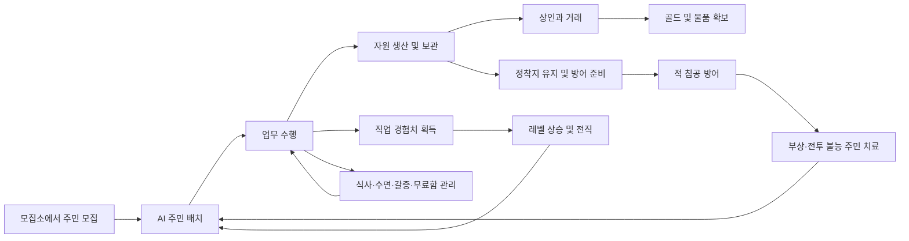
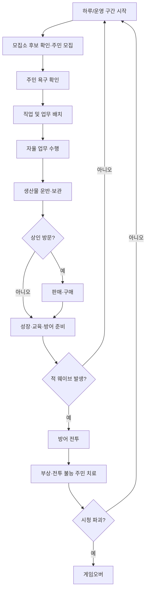
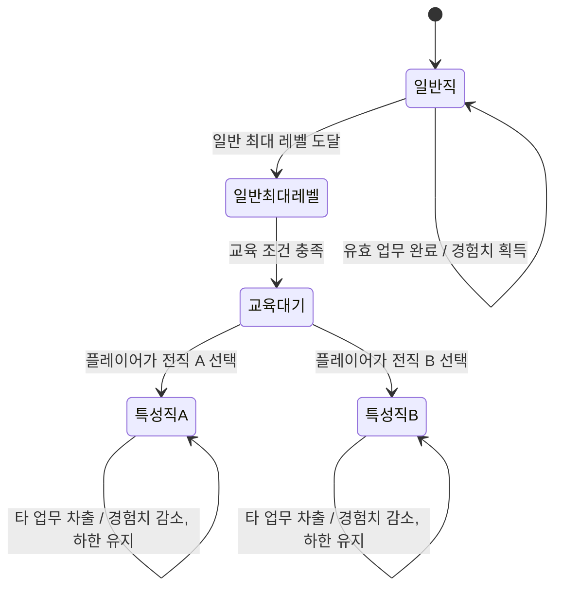
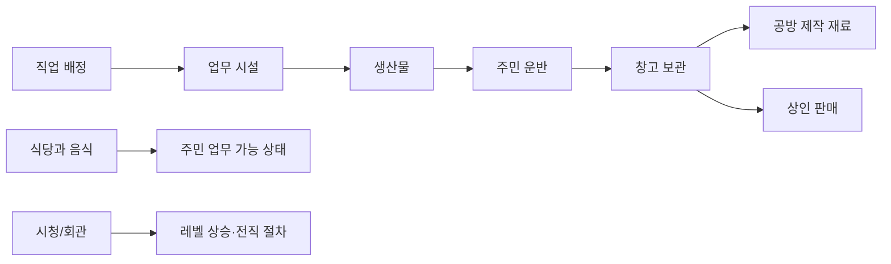
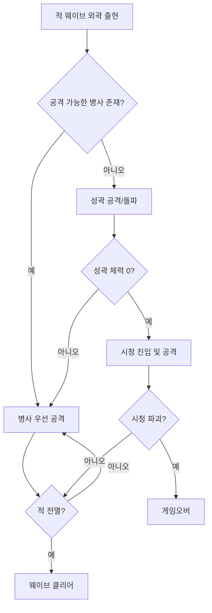
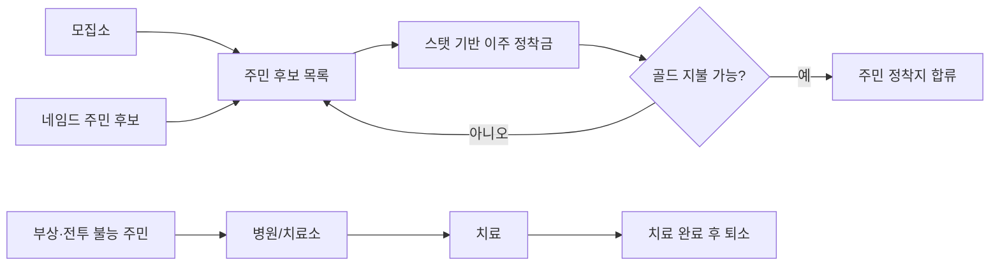

# SPEC

> 문서 상태: 초안 0.2  
> 작성 기준: 2026-06-22  
> 수치 정책: 사용자가 확정하지 않은 수치는 `TBD`로 표기하며 구현 단계에서 임의로 확정하지 않는다.

## 1. Purpose

이 문서는 자율적으로 생활하고 일하는 AI 주민을 성장·배치하여 정착지를 운영하고, 경제와 방어를 유지하는 Unity 2D 게임 프로토타입의 기획 기준을 정의한다.

플레이어가 직접 모든 행동을 수행하기보다 AI 주민의 직업, 전직, 배치와 정착지 시설을 관리하고 그 결과를 관찰하는 것이 핵심 경험이다. 주민의 생존 욕구, 직업 숙련, 생산, 교역, 방어가 서로 영향을 주어 플레이어에게 지속적인 인력 배분 결정을 요구한다.

### 핵심 판타지

> 서로 다른 능력과 경력을 가진 AI 주민들이 자율적으로 살아가는 정착지를 설계하고, 적절한 교육과 인력 배치로 위기를 극복한다.

### 핵심 게임 루프

## 2. Scope

### In Scope

- 개별 AI 주민의 직업 배정과 자율 업무 수행
- 직업 경험치, 레벨, 최대 레벨 및 전직
- 다른 업무 차출에 따른 기존 직업 경험치 감소
- 무작위 개인 스탯과 스탯 기반 업무 성과
- 식당, 창고, 공방, 시청/회관 등 기능 건물
- 모집소를 통한 일반·네임드 주민 모집과 이주 정착금 지불
- 병원 또는 치료소를 통한 부상·전투 불능 주민 치료
- 생산물 보관과 상인을 통한 판매·구매
- 병사 AI, 적 웨이브, 성곽과 시청을 중심으로 한 방어
- 배고픔, 갈증, 피로, 무료함과 불쾌 수치
- 불쾌 수치에 따른 폭동 발생의 기본 개념
- 조정 가능한 게임 수치와 디버그 관찰 수단

### Out of Scope

다음 항목은 아이디어가 폐기된 것이 아니라, 현재 요구사항이 부족하여 이번 문서의 확정 범위에서 제외한다.

- 농사 구역과 훈련 구역의 상세 동작
- 공방 내부 세부 시설 전체 목록과 제작 레시피
- 작물 성장 및 특별 작물 연구의 상세 규칙
- 검사, 궁수 등 개별 전직의 전투 규칙과 스킬
- 폭동 중 AI의 구체적인 공격 대상, 진압, 회복 규칙
- 적 종류, 보스, 공격 패턴 및 웨이브 편성표
- 상인 전용 희귀 물품의 구체적인 목록
- 건설, 철거, 수리 및 시설 배치 규칙
- 저장/불러오기, 튜토리얼, 난이도 선택, 멀티플레이

## 3. Source Requirements

| ID | 원본 요구사항 요약 |
|---|---|
| SRC-001 | AI 주민은 각자 맡은 일을 수행한다. |
| SRC-002 | 맡은 일을 수행할수록 해당 직업 경험치를 얻고 레벨이 오른다. |
| SRC-003 | 다음 레벨에는 이전보다 더 많은 업무 수행이 필요하며 특정 레벨 이후 일반 레벨이 오르지 않는다. |
| SRC-004 | 특성화 교육 건물에서 플레이어가 전직을 선택하며, 전직에 따라 특화 업무가 열린다. |
| SRC-005 | 다른 업무에 차출된 주민은 기존 직업 경험치가 감소하되, 전직했다면 전직 최소 레벨 아래로 내려가지 않는다. |
| SRC-006 | 주민은 힘, 체력, 인내 등의 무작위 스탯을 가지며 업무 성과가 달라진다. |
| SRC-007 | 식당은 주민이 식사하는 곳이며 음식이 없으면 주민은 일하지 않는다. |
| SRC-008 | 창고는 생산직 주민이 결과물을 보관하는 곳이다. |
| SRC-009 | 공방 및 그 하위 시설은 직업에 맞는 물품을 생산한다. |
| SRC-010 | 시청 또는 회관은 전직과 상위 성장에 관련된 중심 건물이다. |
| SRC-011 | 적은 외곽에 침공하고 병사 주민을 우선 공격한다. |
| SRC-012 | 성곽은 별도 체력을 가지며 체력이 소진되면 무너진다. |
| SRC-013 | 성곽이 무너져도 적을 모두 처치하면 웨이브를 클리어한다. |
| SRC-014 | 적이 시청을 파괴하면 게임오버가 된다. |
| SRC-015 | 적은 진행에 따라 점점 강해진다. |
| SRC-016 | 생존·생활 욕구를 해결할 수 없으면 불쾌 수치가 상승하고 임계치에서 폭동이 발생한다. |
| SRC-017 | 상인은 특정 날짜마다 방문한다. |
| SRC-018 | 창고 생산물을 상인에게 판매하여 골드를 얻는다. |
| SRC-019 | 상인은 일반 물품과 낮은 확률로 상인 전용 물품을 판매한다. |
| SRC-020 | 모집소에서 주민 후보를 확인하고 스탯에 따라 달라지는 이주 정착금을 지불하여 주민을 모집한다. |
| SRC-021 | 네임드 주민은 간헐적으로 모집 후보에 등장하며 고정된 외모와 고정된 스탯을 가진다. |
| SRC-022 | 병사 주민은 전투 중 부상·전투 불능·사망할 수 있으며, 성곽이 뚫리고 병사 주민이 모두 전투 불능이면 다른 주민도 같은 위험에 노출된다. |
| SRC-023 | 부상 또는 전투 불능 상태가 된 AI 주민은 병원 또는 치료소에서 치료받고 나온다. |

## 4. Glossary

| 용어 | 정의 |
|---|---|
| AI 주민 | 정착지에서 생활하고 플레이어가 배정한 직업의 업무를 자율 수행하는 개별 개체. |
| 직업 | 주민이 현재 주로 수행하도록 배정된 업무 분류. |
| 직업 경험치 | 특정 직업의 유효 업무 수행으로 누적되는 성장 수치. |
| 직업 레벨 | 해당 직업의 숙련 단계를 나타내는 값. |
| 일반 최대 레벨 | 전직 없이 도달할 수 있는 직업 레벨의 상한. |
| 전직 | 조건을 충족한 주민을 특성화 직업으로 변경하는 플레이어의 선택. |
| 전직 최소 레벨 | 전직한 주민의 직업 경험치 감소로도 내려갈 수 없는 레벨 하한. |
| 차출 | 주민을 기존 직업과 다른 업무에 일시적 또는 지속적으로 배치하는 행위. |
| 업무 성과 | 작업 시간, 생산량, 품질, 성공률 등 업무 결과를 나타내는 값. 세부 구성은 미정이다. |
| 욕구 | 배고픔, 갈증, 피로, 무료함처럼 주민이 주기적으로 해결해야 하는 상태. |
| 불쾌 수치 | 충족되지 않은 욕구로 인해 누적되며 폭동 발생에 영향을 주는 값. |
| 폭동 | 불쾌 수치 임계 도달 후 주민이 정상 업무를 중단하는 위기 상태. 상세 행동은 미정이다. |
| 생산물 | 주민의 업무로 생성되어 운반·보관·판매할 수 있는 자원 또는 물품. |
| 성곽 | 외곽 방어선이며 독립된 체력을 가진 방어 대상. |
| 시청 | 정착지 성장의 중심 시설이자 적에게 파괴될 경우 게임오버를 발생시키는 핵심 건물. 명칭은 임시다. |
| 웨이브 | 외곽에서 출현한 적 집단을 모두 처치할 때까지의 침공 단위. |
| 상인 전용 물품 | 일반 생산이나 획득으로 얻을 수 없고 특정 상인의 판매를 통해서만 얻는 물품. |
| 모집소 | 플레이어가 정착지로 이주할 주민 후보를 확인하고 모집하는 기능 건물. |
| 이주 정착금 | 주민이 정착지로 이주하도록 모집할 때 플레이어가 골드로 지불하는 일회성 비용. |
| 일반 주민 | 생성 규칙에 따라 외모와 스탯이 결정되는 모집 대상 주민. |
| 네임드 주민 | 고유한 정체성을 가지며 외모와 스탯이 고정된 특별 모집 대상 주민. |
| 부상 | 주민이 치료를 필요로 하지만 사망하지는 않은 상태. 세부 단계는 미정이다. |
| 전투 불능 | 주민이 전투 또는 정상 업무를 계속할 수 없는 상태. 사망과의 관계는 미정이다. |
| 병원/치료소 | 부상 또는 전투 불능 주민이 치료를 받고 회복하는 기능 건물. 최종 명칭은 미정이다. |

## 5. Assumptions

| ID | 가정 | 검토 필요성 |
|---|---|---|
| ASM-001 | 각 주민의 직업 경험치와 레벨은 직업별로 별도 관리한다. | 직업 변경·복귀 시 성장 보존 규칙에 영향. |
| ASM-002 | 전직은 자동 발생하지 않고 플레이어의 명시적 선택이 필요하다. | 원본 요구사항에 명시됨. |
| ASM-003 | 전직 선택지는 현재 직업 또는 선행 직업에 따라 달라진다. | 전직 트리 설계에 영향. |
| ASM-004 | 음식 부족은 식당 이용 실패뿐 아니라 주민의 정상 업무 수행을 막는다. | 실제 중단 시점과 예외 직업 확인 필요. |
| ASM-005 | 생산물은 생산 직후 골드로 바뀌지 않고 창고 보관과 판매 절차를 거친다. | 경제 흐름의 핵심 가정. |
| ASM-006 | 시청과 회관은 현재 동일한 중심 건물을 가리킨다. | 최종 명칭과 기능 확정 필요. |
| ASM-007 | 적의 강화는 최소한 웨이브 진행도 또는 경과 날짜 중 하나를 기준으로 한다. | 난이도 곡선에 영향. |
| ASM-008 | 폭동 시스템은 현재 실험 기능이며 상세 규칙이 확정되기 전까지 별도 조정 가능해야 한다. | 핵심 루프 편입 여부 확인 필요. |
| ASM-009 | 이주 정착금은 모집 시 한 번 지불하며 정기 급여는 포함하지 않는다. | 용병 고용과 구분되는 주민 이주 비용이라는 원본 설명을 반영. |
| ASM-010 | 사망한 주민은 병원 또는 치료소의 일반 치료 대상에 포함하지 않는다. | 사망과 부상·전투 불능의 경계를 확정하기 전까지 필요한 안전한 가정. |

## 6. Functional Requirements

이 문서에서 `해야 한다`는 EARS의 필수 요구 표현인 `shall`과 동일한 의미로 사용한다.

### Game Loop

| ID | EARS Type | Requirement | Source | Acceptance Criteria |
|---|---|---|---|---|
| REQ-F-001 | Ubiquitous | 게임은 주민 모집·관리, 생산·보관, 교역, 성장·전직, 방어와 치료가 반복되는 운영 루프를 제공해야 한다. | SRC-001~023 | 각 주요 시스템으로 진입할 수 있고, 한 시스템의 결과가 하나 이상의 다른 시스템 입력으로 사용된다. |
| REQ-F-002 | State-driven | 주민이 정상 상태인 동안, 주민은 현재 배정된 업무를 자율적으로 선택하고 수행해야 한다. | SRC-001 | 플레이어가 매 작업 동작을 직접 명령하지 않아도 배정된 업무가 시작되고 완료된다. |
| REQ-F-003 | Unwanted behavior | 게임오버 조건이 충족되면, 게임은 정상 운영 진행을 중단하고 게임오버 결과를 표시해야 한다. | SRC-014 | 시청 파괴 직후 새로운 정상 업무와 웨이브 진행이 시작되지 않으며 게임오버 상태가 식별된다. |

### AI 주민 성장과 전직

| ID | EARS Type | Requirement | Source | Acceptance Criteria |
|---|---|---|---|---|
| REQ-F-004 | Event-driven | 주민이 현재 직업의 유효 업무를 완료하면, 게임은 해당 직업 경험치를 증가시켜야 한다. | SRC-002 | 업무 완료 전후를 비교했을 때 해당 직업 경험치만 설정된 양만큼 증가한다. |
| REQ-F-005 | Event-driven | 직업 경험치가 다음 레벨 조건에 도달하면, 게임은 정해진 레벨업 절차를 시작해야 한다. | SRC-002, SRC-010 | 조건 미달에서는 레벨이 유지되고 조건 충족 시 자동 또는 승인형 절차 중 확정된 방식으로 정확히 한 단계 상승한다. |
| REQ-F-006 | Ubiquitous | 각 다음 직업 레벨의 요구 경험치는 이전 레벨보다 많아야 한다. | SRC-003 | 전체 레벨 요구량 표에서 다음 단계 요구량이 이전 단계보다 항상 크다. |
| REQ-F-007 | State-driven | 주민이 일반 최대 레벨에 도달한 동안, 게임은 전직 없이 해당 직업의 추가 일반 레벨 상승을 허용하지 않아야 한다. | SRC-003 | 최대 레벨 이후 경험치 이벤트가 발생해도 일반 레벨이 상한을 초과하지 않는다. |
| REQ-F-008 | State-driven | 전직 조건을 충족한 주민이 특성화 교육 시설을 이용할 수 있는 동안, 게임은 가능한 전직 선택지를 플레이어에게 제공해야 한다. | SRC-004 | 조건을 만족한 주민에게만 유효한 전직 후보가 표시되며 플레이어가 하나를 선택할 수 있다. |
| REQ-F-009 | Event-driven | 플레이어가 유효한 전직을 확정하면, 게임은 주민의 직업을 선택한 특성 직업으로 변경해야 한다. | SRC-004 | 확정 전에는 직업이 유지되고 확정 후 선택한 직업과 그 전용 업무가 활성화된다. |
| REQ-F-010 | State-driven | 주민이 특성 직업을 가진 동안, 게임은 해당 직업에 정의된 특화 업무만 수행 후보로 제공해야 한다. | SRC-004 | 작물 연구원 등 특성 직업이 일반 직업에 없는 정의된 업무를 선택할 수 있다. |
| REQ-F-011 | State-driven | 주민이 기존 직업이 아닌 업무에 차출된 동안, 게임은 기존 직업 경험치를 정해진 규칙에 따라 감소시켜야 한다. | SRC-005 | 차출 전후의 동일 시간 구간을 비교하면 기존 직업 경험치가 설정된 양만큼 감소한다. |
| REQ-F-012 | State-driven | 전직한 주민의 기존 직업 경험치가 감소하는 동안, 게임은 그 주민의 레벨이 전직 최소 레벨 아래로 내려가지 않도록 해야 한다. | SRC-005 | 장시간 차출 후에도 레벨과 경험치가 정의된 전직 하한 미만이 되지 않는다. |

### AI 주민 스탯과 업무 성과

| ID | EARS Type | Requirement | Source | Acceptance Criteria |
|---|---|---|---|---|
| REQ-F-013 | Event-driven | 새 주민이 생성되면, 게임은 정의된 범위 안에서 개인 스탯을 생성해야 한다. | SRC-006 | 다수 주민 생성 시 각 스탯은 허용 범위를 벗어나지 않으며 서로 다른 조합이 생성될 수 있다. |
| REQ-F-014 | Ubiquitous | 주민은 최소한 힘, 체력, 인내를 포함하는 개인 스탯 정보를 가져야 한다. | SRC-006 | 각 주민의 상태에서 세 스탯 값을 조회할 수 있다. |
| REQ-F-015 | Event-driven | 주민이 업무를 수행하면, 게임은 해당 업무와 관련된 스탯을 업무 성과 계산에 반영해야 한다. | SRC-006 | 관련 스탯만 다른 두 주민을 동일 조건에서 비교했을 때 정의된 성과 항목에 차이가 발생한다. |

### 생활 욕구와 폭동

| ID | EARS Type | Requirement | Source | Acceptance Criteria |
|---|---|---|---|---|
| REQ-F-016 | Ubiquitous | 각 주민은 배고픔, 갈증, 피로, 무료함 상태를 개별적으로 가져야 한다. | SRC-016 | 주민별로 네 욕구의 현재 상태를 독립적으로 조회할 수 있다. |
| REQ-F-017 | State-driven | 주민의 욕구가 해결되지 않은 동안, 게임은 정의된 조건에 따라 그 주민의 불쾌 수치를 증가시켜야 한다. | SRC-016 | 해결 수단이 없는 동일 조건에서 시간이 경과하면 불쾌 수치가 증가한다. |
| REQ-F-018 | Event-driven | 주민의 불쾌 수치가 폭동 임계치에 도달하면, 게임은 그 주민을 폭동 상태로 전환해야 한다. | SRC-016 | 임계치 미만에서는 폭동이 시작되지 않고 임계치 도달 시 정확히 한 번 상태 전환이 발생한다. |
| REQ-F-019 | State-driven | 주민이 폭동 상태인 동안, 게임은 그 주민이 정상 업무를 수행하지 못하게 해야 한다. | SRC-016 | 폭동 상태가 유지되는 동안 생산·운반 등 배정 업무가 시작되지 않는다. |

### 기능 건물과 생산

| ID | EARS Type | Requirement | Source | Acceptance Criteria |
|---|---|---|---|---|
| REQ-F-020 | State-driven | 식당에 이용 가능한 음식이 있는 동안, 식사가 필요한 주민은 식당에서 음식을 소비하여 배고픔을 해결할 수 있어야 한다. | SRC-007 | 식사 완료 시 음식 재고가 감소하고 주민의 배고픔이 정의된 양만큼 회복된다. |
| REQ-F-021 | Unwanted behavior | 이용 가능한 음식이 없으면, 게임은 영향받는 주민이 정상 업무를 수행하지 못하게 해야 한다. | SRC-007 | 음식 재고가 0인 조건에서 해당 주민의 정상 업무가 시작 또는 완료되지 않는다. |
| REQ-F-022 | Event-driven | 생산직 주민이 운반 가능한 생산물을 만들면, 게임은 그 생산물을 창고로 운반하고 보관할 수 있게 해야 한다. | SRC-008 | 운반과 보관이 완료되면 주민의 운반량은 감소하고 창고 재고는 같은 양만큼 증가한다. |
| REQ-F-023 | Unwanted behavior | 창고가 생산물을 수용할 수 없으면, 게임은 생산물을 소실시키지 않고 정의된 대기 또는 생산 중단 상태로 처리해야 한다. | SRC-008 | 창고 수용 실패 후 생산물 총량이 이유 없이 감소하지 않고 상태가 식별된다. |
| REQ-F-024 | State-driven | 유효한 직업의 주민이 필요한 공방 시설과 재료를 이용할 수 있는 동안, 게임은 직업에 맞는 물품을 생산할 수 있게 해야 한다. | SRC-009 | 조건을 충족하면 재료가 소비되고 선택된 제작 결과물이 생성된다. |
| REQ-F-025 | State-driven | 전직한 주민이 전직 전용 공방 업무 조건을 충족한 동안, 게임은 해당 특화 물품의 생산을 허용해야 한다. | SRC-009 | 유효한 전직자는 전용 제작을 시작할 수 있고 자격 없는 주민은 시작할 수 없다. |
| REQ-F-026 | State-driven | 주민이 성장 또는 전직 조건을 충족하고 시청을 이용할 수 있는 동안, 게임은 확정된 성장 절차를 제공해야 한다. | SRC-010 | 조건을 충족하지 않거나 시청을 이용할 수 없으면 절차가 완료되지 않는다. |

### 적 침공과 방어

| ID | EARS Type | Requirement | Source | Acceptance Criteria |
|---|---|---|---|---|
| REQ-F-027 | Event-driven | 적 웨이브가 시작되면, 게임은 적을 정착지 외곽의 유효한 침공 지점에 출현시켜야 한다. | SRC-011 | 웨이브 시작 시 정의된 수의 적이 유효한 외곽 지점에 생성된다. |
| REQ-F-028 | State-driven | 공격 가능한 병사 주민이 존재하는 동안, 적은 다른 공격 대상보다 병사 주민을 우선해야 한다. | SRC-011 | 동일 조건에서 병사와 비병사 또는 건물이 함께 존재하면 병사가 먼저 표적이 된다. |
| REQ-F-029 | Ubiquitous | 성곽은 다른 개체와 독립된 체력 값을 가져야 한다. | SRC-012 | 성곽 피해가 다른 건물이나 주민의 체력을 직접 감소시키지 않는다. |
| REQ-F-030 | Event-driven | 성곽 체력이 0에 도달하면, 게임은 성곽을 붕괴 상태로 전환해야 한다. | SRC-012 | 체력이 0보다 큰 동안 유지되고 0 도달 시 통과 또는 붕괴 상태가 표시된다. |
| REQ-F-031 | Event-driven | 현재 웨이브의 모든 적이 처치되면, 게임은 성곽 상태와 관계없이 해당 웨이브를 클리어 처리해야 한다. | SRC-013 | 성곽이 붕괴된 테스트에서도 마지막 적 처치 후 웨이브 성공이 기록된다. |
| REQ-F-032 | Event-driven | 시청 체력이 0에 도달하면, 게임은 즉시 게임오버 상태로 전환해야 한다. | SRC-014 | 적이 남아 있는지와 관계없이 시청 파괴 후 게임오버가 발생한다. |
| REQ-F-033 | Event-driven | 적 진행 단계가 상승하면, 게임은 확정된 난이도 규칙에 따라 이후 적 전력을 증가시켜야 한다. | SRC-015 | 동일한 적 정의 또는 웨이브를 기준으로 이전 단계보다 하나 이상의 전력 지표가 증가한다. |

### 상인과 경제

| ID | EARS Type | Requirement | Source | Acceptance Criteria |
|---|---|---|---|---|
| REQ-F-034 | Event-driven | 설정된 상인 방문 날짜가 되면, 게임은 상인을 유효한 방문 위치에 등장시켜야 한다. | SRC-017 | 비방문일에는 상인이 없고 방문일에는 거래 가능한 상인이 등장한다. |
| REQ-F-035 | State-driven | 상인이 방문 중이고 판매할 생산물이 창고에 있는 동안, 게임은 해당 생산물을 상인에게 판매할 수 있게 해야 한다. | SRC-018 | 판매 완료 시 창고 재고가 감소하고 정해진 판매가만큼 골드가 증가한다. |
| REQ-F-036 | State-driven | 상인이 방문 중인 동안, 게임은 그 방문에 배정된 판매 물품과 가격을 플레이어가 확인하고 구매할 수 있게 해야 한다. | SRC-019 | 목록에 있는 물품은 충분한 골드로 구매할 수 있고 구매 후 골드와 재고가 정확히 갱신된다. |
| REQ-F-037 | Event-driven | 상인의 판매 목록을 생성하면, 게임은 확정된 규칙에 따라 일반 획득 물품을 포함해야 한다. | SRC-019 | 다수 방문 표본에서 정의된 일반 물품 풀의 물품이 설정 규칙대로 등장한다. |
| REQ-F-038 | Optional feature | 상인 전용 물품 기능이 활성화된 경우, 게임은 낮은 설정 확률로 상인 전용 물품을 판매 목록에 포함해야 한다. | SRC-019 | 고정 난수 또는 충분한 표본 테스트에서 설정 확률 규칙과 전용 물품 풀 제한이 지켜진다. |

### 주민 모집과 치료

| ID | EARS Type | Requirement | Source | Acceptance Criteria |
|---|---|---|---|---|
| REQ-F-042 | Event-driven | 플레이어가 모집소를 이용하면, 게임은 현재 모집 가능한 주민 후보를 표시해야 한다. | SRC-020 | 모집소 화면에서 후보별 식별 정보, 스탯과 이주 정착금을 확인할 수 있다. |
| REQ-F-043 | Event-driven | 플레이어가 주민 모집을 확정하면, 게임은 해당 후보의 이주 정착금을 골드에서 차감하고 그 주민을 정착지에 합류시켜야 한다. | SRC-020 | 골드가 비용만큼 감소하고 선택한 후보가 정확히 한 번 주민 목록에 추가된다. |
| REQ-F-044 | Unwanted behavior | 플레이어의 골드가 이주 정착금보다 적으면, 게임은 해당 주민의 모집을 완료하지 않아야 한다. | SRC-020 | 골드와 후보 목록이 유지되고 모집 실패 원인이 표시된다. |
| REQ-F-045 | Ubiquitous | 일반 주민 후보의 이주 정착금은 그 후보의 스탯을 반영하여 산정해야 한다. | SRC-020 | 동일한 가격 규칙에서 비용에 반영되는 스탯이 높은 후보는 낮은 후보보다 이주 정착금이 낮아지지 않는다. |
| REQ-F-046 | Event-driven | 모집 후보 목록이 생성되면, 게임은 설정된 등장 규칙에 따라 네임드 주민을 후보에 포함해야 한다. | SRC-021 | 고정 난수 또는 충분한 표본에서 네임드 주민이 설정된 규칙에 따라 간헐적으로 등장한다. |
| REQ-F-047 | Ubiquitous | 각 네임드 주민은 정의된 고정 외모와 고정 스탯을 사용해야 한다. | SRC-021 | 동일한 네임드 주민 데이터로 생성한 모든 후보의 외모와 스탯이 정의값과 일치한다. |
| REQ-F-048 | State-driven | 부상 또는 전투 불능 주민이 병원 또는 치료소를 이용할 수 있는 동안, 게임은 그 주민이 해당 시설에서 치료받을 수 있게 해야 한다. | SRC-023 | 유효한 주민이 시설에 도착하면 치료 상태가 시작되고 정상 업무 또는 전투를 동시에 수행하지 않는다. |
| REQ-F-049 | Event-driven | 주민의 치료가 완료되면, 게임은 정의된 회복 결과를 적용하고 그 주민이 병원 또는 치료소에서 나오게 해야 한다. | SRC-023 | 치료 완료 후 주민의 치료 상태가 종료되고 시설 점유가 해제되며 회복된 상태를 조회할 수 있다. |
| REQ-F-050 | Event-driven | 주민이 전투 피해 판정 조건을 충족하면, 게임은 정의된 규칙에 따라 그 주민을 부상, 전투 불능 또는 사망 상태로 전환해야 한다. | SRC-022 | 각 상태의 시험 조건에서 정확히 해당 상태로 전환되며 서로 모순되는 상태가 동시에 적용되지 않는다. |
| REQ-F-051 | State-driven | 성곽이 돌파되고 공격 가능한 병사 주민이 없는 동안, 게임은 비병사 주민을 적의 공격 대상에 포함해야 한다. | SRC-022 | 조건 충족 전에는 비병사 주민이 공격 대상에서 제외되고 조건 충족 후에는 유효한 공격 후보가 된다. |

### UI / UX

| ID | EARS Type | Requirement | Source | Acceptance Criteria |
|---|---|---|---|---|
| REQ-F-039 | Event-driven | 플레이어가 주민을 선택하면, 게임은 그 주민의 직업, 레벨, 경험치, 스탯, 욕구, 불쾌 수치와 현재 행동을 표시해야 한다. | SRC-001~006, SRC-016 | 선택한 주민의 각 필수 상태를 같은 정보 화면에서 확인할 수 있다. |
| REQ-F-040 | Event-driven | 플레이어가 기능 건물을 선택하면, 게임은 해당 건물의 기능 상태와 관련 재고 또는 체력을 표시해야 한다. | SRC-007~010, SRC-012, SRC-014 | 식당·창고·공방·시청·성곽에서 각 건물에 필요한 핵심 정보가 표시된다. |
| REQ-F-041 | Event-driven | 주민이 업무 중단, 전직 가능, 폭동 또는 전투 불능 상태가 되면, 게임은 플레이어가 원인을 식별할 수 있는 피드백을 제공해야 한다. | SRC-003~007, SRC-011, SRC-016 | 각 상태에서 원인을 구분할 수 있는 텍스트 또는 시각 표시가 존재한다. |

## 7. Non-Functional Requirements

| ID | EARS Type | Requirement | Source | Acceptance Criteria |
|---|---|---|---|---|
| REQ-NF-001 | Ubiquitous | 게임은 주민과 적의 수가 목표 개체 수 `TBD`일 때 목표 프레임률 `TBD`를 유지해야 한다. | 품질 기준 | 목표 하드웨어와 측정 장면이 확정된 후 프레임 시간 측정 결과가 기준을 충족한다. |
| REQ-NF-002 | Ubiquitous | 직업, 전직, 레벨, 경험치, 스탯, 욕구, 건물, 적, 웨이브, 상인 관련 조정 수치는 코드 변경 없이 편집할 수 있어야 한다. | 전체 시스템 | 빌드 전 데이터 설정 변경만으로 각 수치가 게임에 반영된다. |
| REQ-NF-003 | Unwanted behavior | 필수 목적지, 건물 또는 데이터가 누락되면, 게임은 원인을 식별 가능한 오류로 기록하고 관련 행동을 안전하게 중단해야 한다. | 안정성 기준 | 누락 테스트에서 무한 반복이나 처리되지 않은 예외 없이 대상과 원인이 로그에 기록된다. |
| REQ-NF-004 | Ubiquitous | 동일한 초기 데이터와 난수 시드를 사용한 시뮬레이션은 동일한 주민 스탯 및 상인 목록을 재현할 수 있어야 한다. | 검증 기준 | 같은 입력과 시드의 반복 실행 결과가 일치한다. |
| REQ-NF-005 | Ubiquitous | 시스템 상태 변화는 주민별로 독립되어 한 주민의 경험치, 욕구 또는 불쾌 수치 변경이 다른 주민에게 직접 적용되지 않아야 한다. | SRC-002, SRC-005, SRC-006, SRC-016 | 한 주민만 변경하는 테스트에서 다른 주민의 대응 값이 유지된다. |

## 8. Data Requirements

| ID | 데이터 영역 | 필수 데이터 | Source |
|---|---|---|---|
| REQ-D-001 | 직업 | 직업 ID, 표시명, 가능한 업무, 관련 스탯, 경험치 획득량, 레벨 요구 경험치, 일반 최대 레벨 | SRC-001~006 |
| REQ-D-002 | 전직 | 선행 직업, 요구 레벨, 교육 시설, 전직 최소 레벨, 선택 가능한 후속 직업, 해금 업무 | SRC-004, SRC-005 |
| REQ-D-003 | 경험치 감소 | 차출 판정 조건, 감소 시작 지연, 시간당 감소량 또는 감소식, 감소 하한 | SRC-005 |
| REQ-D-004 | 주민 스탯 | 스탯 ID, 표시명, 생성 범위, 분포, 관련 업무, 성과 계산 방식 | SRC-006 |
| REQ-D-005 | 욕구 | 욕구별 범위, 변화 속도, 행동 임계치, 해결량, 불쾌 수치 기여도 | SRC-007, SRC-016 |
| REQ-D-006 | 폭동 | 시작 임계치, 해제 조건, 지속 규칙, 폭동 중 행동, 대상 우선순위 | SRC-016 |
| REQ-D-007 | 건물 | 건물 ID, 기능, 체력, 수용량, 이용 조건, 관련 직업, 입력·출력 자원 | SRC-007~010, SRC-012, SRC-014 |
| REQ-D-008 | 물품 | 물품 ID, 분류, 최대 적재량, 보관 조건, 제작식, 판매가, 구매가, 획득 경로 | SRC-008, SRC-009, SRC-018, SRC-019 |
| REQ-D-009 | 적 | 적 ID, 체력, 공격력, 공격 속도, 이동 속도, 표적 규칙, 보상 | SRC-011, SRC-015 |
| REQ-D-010 | 웨이브 | 출현 날짜/조건, 적 편성, 출현 지점, 강화 계수, 웨이브 보상 | SRC-011~015 |
| REQ-D-011 | 상인 | 방문 주기, 체류 시간, 일반 물품 풀, 전용 물품 풀, 등장 확률, 수량과 가격 | SRC-017~019 |
| REQ-D-012 | 경제 | 시작 골드, 판매·구매 가격, 가격 변동 여부, 거래 단위 | SRC-018, SRC-019 |
| REQ-D-013 | 주민 모집 | 후보 ID, 일반·네임드 구분, 후보 스탯, 외모, 이주 정착금, 등장 규칙, 모집 가능 상태 | SRC-020, SRC-021 |
| REQ-D-014 | 치료 | 치료 대상 상태, 시설 수용량, 치료 시간, 회복 결과, 필요 자원 또는 비용, 퇴소 조건 | SRC-023 |
| REQ-D-015 | 전투 피해 상태 | 부상·전투 불능·사망 판정 조건, 상태별 행동 제한, 공격 대상 조건 | SRC-022 |

## 9. Telemetry / Debug Requirements

| ID | EARS Type | Requirement | Source | Acceptance Criteria |
|---|---|---|---|---|
| REQ-T-001 | Ubiquitous | 개발 빌드는 선택한 주민의 현재 행동, 대상, 직업 경험치 변화, 욕구 변화 및 불쾌 수치 변화 원인을 확인할 수 있어야 한다. | 시스템 검증 | 선택한 주민의 상태 변화 원인을 실시간 또는 로그에서 추적할 수 있다. |
| REQ-T-002 | Ubiquitous | 개발 빌드는 현재 날짜, 다음 상인 방문일, 현재 웨이브, 다음 웨이브 조건을 확인할 수 있어야 한다. | 시스템 검증 | 네 정보를 디버그 화면 또는 로그에서 확인할 수 있다. |
| REQ-T-003 | Ubiquitous | 개발 빌드는 창고 재고의 생산, 반입, 반출, 판매, 소비 변화를 원인별로 추적할 수 있어야 한다. | 경제 검증 | 재고 변화 기록에 물품, 수량, 원인과 대상이 포함된다. |
| REQ-T-004 | Optional feature | 고정 난수 시드 기능이 활성화된 경우, 게임은 사용한 시드를 표시하고 재입력할 수 있어야 한다. | REQ-NF-004 | 표시된 시드를 재입력한 실행에서 무작위 결과가 재현된다. |

## 10. Traceability Matrix

| Source | SPEC Requirement IDs |
|---|---|
| SRC-001 | REQ-F-001, REQ-F-002, REQ-F-039 |
| SRC-002 | REQ-F-004, REQ-F-005, REQ-NF-005 |
| SRC-003 | REQ-F-006, REQ-F-007, REQ-F-041 |
| SRC-004 | REQ-F-008, REQ-F-009, REQ-F-010, REQ-D-002 |
| SRC-005 | REQ-F-011, REQ-F-012, REQ-D-003, REQ-NF-005 |
| SRC-006 | REQ-F-013, REQ-F-014, REQ-F-015, REQ-F-039, REQ-D-004 |
| SRC-007 | REQ-F-020, REQ-F-021, REQ-F-041, REQ-D-005, REQ-D-007 |
| SRC-008 | REQ-F-022, REQ-F-023, REQ-D-007, REQ-D-008 |
| SRC-009 | REQ-F-024, REQ-F-025, REQ-D-007, REQ-D-008 |
| SRC-010 | REQ-F-005, REQ-F-026, REQ-D-007 |
| SRC-011 | REQ-F-027, REQ-F-028, REQ-D-009, REQ-D-010 |
| SRC-012 | REQ-F-029, REQ-F-030, REQ-F-040, REQ-D-007 |
| SRC-013 | REQ-F-031, REQ-D-010 |
| SRC-014 | REQ-F-003, REQ-F-032, REQ-D-007 |
| SRC-015 | REQ-F-033, REQ-D-009, REQ-D-010 |
| SRC-016 | REQ-F-016, REQ-F-017, REQ-F-018, REQ-F-019, REQ-F-039, REQ-F-041, REQ-D-005, REQ-D-006 |
| SRC-017 | REQ-F-034, REQ-D-011 |
| SRC-018 | REQ-F-035, REQ-D-008, REQ-D-012 |
| SRC-019 | REQ-F-036, REQ-F-037, REQ-F-038, REQ-D-008, REQ-D-011, REQ-D-012 |
| SRC-020 | REQ-F-042, REQ-F-043, REQ-F-044, REQ-F-045, REQ-D-013 |
| SRC-021 | REQ-F-046, REQ-F-047, REQ-D-013 |
| SRC-022 | REQ-F-050, REQ-F-051, REQ-D-015 |
| SRC-023 | REQ-F-048, REQ-F-049, REQ-D-014 |

## 11. Open Questions

수치 질문은 이후 별도 밸런스 표로 확정한다. 아래 질문은 수치 이전에 시스템 규칙을 결정해야 하는 항목이다.

| ID | 미결정 질문 | 영향 | 권장 결정 주체 |
|---|---|---|---|
| Q-001 | 직업 경험치는 작업 시간, 작업 완료 횟수, 생산량 중 무엇을 기준으로 얻는가? | 반복 작업 악용과 직업별 성장 속도 | 기획자 |
| Q-002 | 경험치 조건 충족 시 레벨업은 자동인가, 시청에서 플레이어 승인이 필요한가? | 시청 기능과 성장 조작 빈도 | 기획자 |
| Q-003 | 주민이 여러 직업의 경험치와 레벨을 동시에 보존하는가? | 직업 변경, 차출, UI와 저장 데이터 | 기획자 |
| Q-004 | 전직 후 원래 직업으로 복귀하거나 다른 전직으로 재전직할 수 있는가? | 전직 트리와 선택의 영구성 | 기획자 |
| Q-005 | 직업 경험치 감소는 차출 즉시 시작되는가, 유예 시간 이후 시작되는가? | 인력 재배치 부담과 마이크로 관리 | 기획자 |
| Q-006 | 전직 최소 레벨은 모든 전직에 공통인가, 전직별로 다른가? | 성장 데이터 구조와 밸런스 | 기획자 |
| Q-007 | 힘, 체력, 인내 외에 필요한 스탯은 무엇이며 각 스탯은 어떤 성과에 영향을 주는가? | 주민 개성과 직업 적합성 | 기획자 |
| Q-008 | 음식이 없을 때 모든 주민이 즉시 일을 멈추는가, 배고픔 임계치에 도달한 주민만 멈추는가? | 식량난 난이도와 기존 욕구 시스템 | 기획자 |
| Q-009 | 갈증과 피로를 해결할 식수원 및 휴식 시설은 어떤 건물인가? | 생활 시설 목록과 행동 목적지 | 기획자 |
| Q-010 | 무료함은 어떤 활동으로 감소하며, 업무 자체가 무료함에 영향을 주는가? | 폭동 예방 수단 | 기획자 |
| Q-011 | 공방은 하나의 건물 안에 하위 설비를 두는가, 대장간·건설소 등을 별도 건물로 짓는가? | 건물 계층과 UI | 기획자 |
| Q-012 | 창고에는 총수용량 또는 물품별 수용량 제한이 있는가? | 생산 중단과 물류 난이도 | 기획자 |
| Q-013 | 생산물을 상인에게 누가 운반하며, 거래는 물리적 운반 완료 후 성립하는가? | AI 행동, 거래 속도, 손실 가능성 | 기획자 |
| Q-014 | 상인의 방문은 고정 주기인가, 달력의 특정 날짜인가, 무작위 범위인가? | 경제 예측 가능성과 날짜 시스템 | 기획자 |
| Q-015 | 적 웨이브는 날짜, 플레이어 성장, 이전 웨이브 완료 중 무엇으로 시작되는가? | 운영 템포와 난이도 | 기획자 |
| Q-016 | 적이 성곽을 어떤 방식으로 돌파하며, 성곽이 남아 있어도 병사를 공격할 수 있는가? | 전투 표적 및 경로 규칙 | 기획자 |
| Q-017 | 성곽과 시청은 웨이브 사이에 자동 복구되는가, 자원과 인력이 수리해야 하는가? | 방어와 생산 경제의 연결 | 기획자 |
| Q-018 | 성곽이 돌파되고 병사가 모두 전투 불능이면 적은 어떤 비병사 주민을 우선 공격하며, 다른 건물도 공격하는가? | 패배 과정과 민간인 표적 우선순위 | 기획자 |
| Q-019 | 폭동 상태의 주민은 단순히 업무를 거부하는가, 시설·주민을 공격하거나 이탈하는가? | 폭동 구현 범위와 게임오버 가능성 | 기획자 |
| Q-020 | 폭동은 개인 단위인가, 주변 주민에게 전파되는 집단 상태인가? | 시뮬레이션 규모와 진압 시스템 | 기획자 |
| Q-021 | 게임의 최종 승리 조건 또는 장기 목표는 무엇인가? | 전체 진행 구조와 콘텐츠 종료점 | 기획자 |
| Q-022 | 플레이어는 주민에게 직업만 지정하는가, 우선순위·근무지·교대 시간도 지정하는가? | 관리 UI와 AI 선택 정책 | 기획자 |
| Q-023 | 주민의 사망은 영구적인가, 부상·전투 불능과 어떤 조건으로 구분되는가? | 치료 가능 범위, 인구 손실과 난이도 | 기획자 |
| Q-024 | 날짜의 길이와 낮/밤 주기가 존재하며 업무·수면·상인·침공에 영향을 주는가? | 모든 시간 기반 시스템 | 기획자 |
| Q-025 | 모집 후보는 언제, 몇 명씩, 어떤 방식으로 갱신되는가? | 인구 확보 속도와 모집소 UI | 기획자 |
| Q-026 | 어떤 스탯을 어떤 가중치로 이주 정착금에 반영하며 최소·최대 비용이 있는가? | 경제 밸런스와 후보 가치 판단 | 기획자 |
| Q-027 | 네임드 주민의 등장 확률, 중복 등장 가능 여부와 재등장 규칙은 무엇인가? | 희소성과 수집 경험 | 기획자 |
| Q-028 | 병원 또는 치료소의 수용 인원, 치료 시간, 치료 비용이나 소모 자원은 무엇인가? | 방어 실패 복구 속도와 시설 가치 | 기획자 |
| Q-029 | 치료 완료 시 체력만 회복하는가, 부상·전투 불능 상태도 모두 해제하는가? | 치료 결과와 AI 업무 복귀 조건 | 기획자 |
